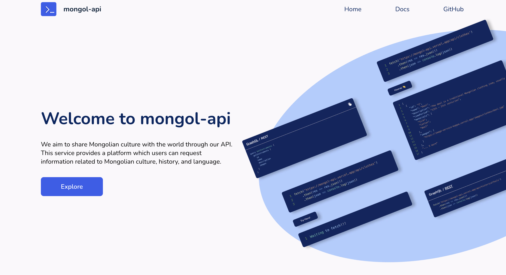

# 🚀 Welcome to Mongol-API – Immerse Yourself in Mongolian Culture! 🌟

Explore the captivating world of Mongolian culture, tradition, and history with Mongol-API, your gateway to this rich heritage. We're excited to introduce four key microservices that will elevate your developer experience.

🔗 **[Mongol-API Web](https://mongol-api.vercel.app/)**: Your hub for development documentation and essential information.

🖼️ **[Mongol-API Images Service](https://image-service-kappa.vercel.app)**: A dedicated service for deploying essential images and providing them through our API.

🌐 **[Mongol-API REST](https://mongol-api-rest.vercel.app)**: This service offers a robust REST API for developers.

🚀 **[Mongol-API GraphQL](https://mongol-api-graphql.vercel.app/api/graphql)**: Tailored for developers looking for a more systematic approach to data fetching.

These microservices work harmoniously, offering diverse ways to engage with Mongolian heritage and enhance your projects.

In the spirit of collaboration and community, we are thrilled to announce that Mongol-API is now open source. You can contribute your passion for coding to this exciting project, helping shape the future of Mongol-API. Your insights and expertise can make this experience even more enriching for everyone. Let's embark on this journey together! 🌍✨

Explore, create, and innovate with Mongol-API today!

#mongolAPI #Release #MongolianCulture

## Meet the Developers 🖥️

👨‍💻 [Duurenbayar Ulziiduuren](https://github.com/DuurenbayarUlz)
👨‍💻 [Elbeg Amarbayasgalan](https://github.com/amar9elbeg)
👩‍💻 [Anujin Buyannemekh](https://github.com/Anujinnb)

## Meet the Designer 🎨

🎨 [Munkhkhuleg Tserenpurev](#)

## Important Endpoints 🌐

- **REST Endpoint**: [https://mongol-api-rest.vercel.app](https://mongol-api-rest.vercel.app)
- **GraphQL Endpoint**: [https://mongol-api-graphql.vercel.app/api/graphql](https://mongol-api-graphql.vercel.app/api/graphql)

## Explore Mongol-API 🌐

Visit the [Mongol-API Website](https://mongol-api.vercel.app) for more information and start your journey into Mongolian culture today!
